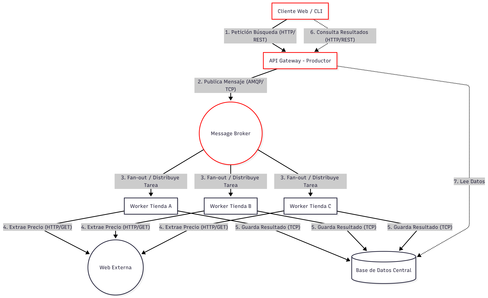

# Proyecto Integrador - Sistemas Distribuidos: 

Davila-Moreno-Martinez-Lella

## Arquitectura

### Descripción General

El sistema implementa una arquitectura distribuida orientada a la **comparación de precios** entre múltiples tiendas online. Sigue un patrón **productor-consumidor** con distribución de tareas mediante un **Message Broker** y un esquema de **fan-out** para paralelizar la extracción de datos desde fuentes externas.

### Componentes

| Componente | Rol | Protocolo |
|---|---|---|
| **Cliente Web / CLI** | Punto de entrada del usuario. Envía solicitudes de búsqueda y consulta resultados. | HTTP/REST |
| **API Gateway - Productor** | Recibe las peticiones del cliente, publica tareas en el broker y sirve los resultados almacenados. | HTTP/REST (entrada) · AMQP/TCP (salida al broker) · TCP (lectura de BD) |
| **Message Broker** | Cola de mensajes que distribuye las tareas a los workers mediante un exchange de tipo **fan-out**. | AMQP/TCP |
| **Workers (Tienda A, B, C)** | Consumidores que realizan web scraping sobre las tiendas asignadas y persisten los resultados. | HTTP/GET (scraping) · TCP (escritura en BD) |
| **Web Externa** | Sitios web de las tiendas de donde se extraen los precios de los productos. | HTTP |
| **Base de Datos Central** | Almacén persistente donde se guardan los resultados de las búsquedas de cada worker. | TCP |

### Flujo del Sistema (paso a paso)

1. **Petición de búsqueda** — El **Cliente Web / CLI** envía una solicitud de búsqueda de un producto al **API Gateway** mediante una petición **HTTP/REST**.

2. **Publicación del mensaje** — El **API Gateway (Productor)** recibe la petición y publica un mensaje con los datos de la búsqueda en el **Message Broker** utilizando el protocolo **AMQP/TCP**.

3. **Distribución fan-out** — El **Message Broker** distribuye el mensaje a todos los **Workers** suscritos (Tienda A, Tienda B, Tienda C) mediante un exchange de tipo **fan-out**, de modo que cada worker recibe una copia de la tarea.

4. **Extracción de precios** — Cada **Worker** realiza una petición **HTTP/GET** a la **Web Externa** correspondiente a su tienda para extraer el precio del producto solicitado (web scraping).

5. **Persistencia de resultados** — Cada **Worker** guarda el resultado obtenido (producto, precio, tienda) en la **Base de Datos Central** mediante una conexión **TCP**.

6. **Consulta de resultados** — El **Cliente Web / CLI** realiza una nueva petición **HTTP/REST** al **API Gateway** para consultar los resultados de la búsqueda.

7. **Lectura de datos** — El **API Gateway** lee los resultados almacenados desde la **Base de Datos Central** y los devuelve al cliente, permitiendo la comparación de precios entre las distintas tiendas.
